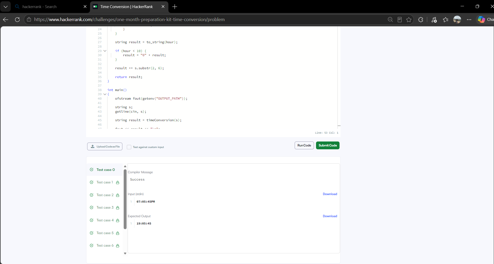

# HackerRank 3rd Semester Portfolio

This repository contains my solutions for the HackerRank Algorithmic Problem-Solving activity.

## HackerRank Profile

**Profile:** https://www.hackerrank.com/profile/ujjwal200612

## Problems Completed

| No. | Problem | Main Concept | Time Complexity | Space Complexity |
|---|---|---|---|---|
| 1 | Diagonal Difference | 2D Arrays | O(N) | O(1) |
| 2 | Dynamic Array | Vectors, XOR | O(N + Q) | O(N) |
| 3 | Time Conversion | Strings and Logic | O(1) | O(1) |
| 4 | Compare the Triplets | Comparison | O(1) | O(1) |
| 5 | Sparse Arrays | Hash Map / Frequency Counting | O(N + Q) | O(N) |

## Accepted Submission Evidence

### 1. Diagonal Difference

### 2. Dynamic Array

### 3. Time Conversion

### 4. Compare the Triplets

### 5. Sparse Arrays

## HackerRank Profile and Badge Evidence

The profile screenshot shows my public HackerRank profile and current Problem Solving badge.

> Note: The profile screenshot shows my public HackerRank profile and my 3-star Problem Solving badge.
## Reflection

While solving these problems, I focused on choosing simple and efficient approaches rather than using unnecessary operations. For Diagonal Difference, I accessed only the two diagonals while traversing the matrix once, which keeps the solution at O(N) time and O(1) extra space. Dynamic Array required careful use of vectors and the XOR operation to calculate the sequence index efficiently. In Time Conversion, I handled the AM and PM cases directly and avoided unnecessary processing.

Compare the Triplets only needs a fixed number of comparisons, so its complexity remains constant. For Sparse Arrays, frequency counting with an unordered map avoids repeatedly scanning the complete list for every query and gives an efficient overall approach. These problems helped me understand how the choice of data structure and algorithm affects time and space complexity. They also gave me practice in writing solutions that are short, readable, and suitable for larger inputs.
